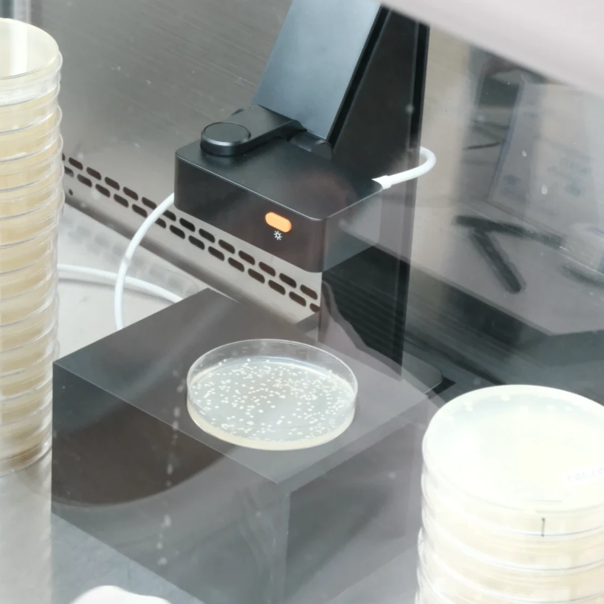
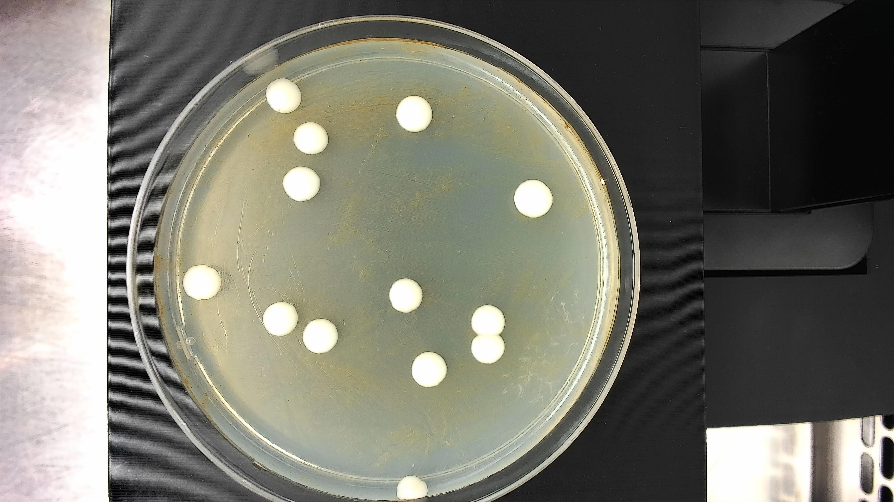

# WeCFU imaging hardware

The physical setup we use to take the petri-dish photos that WeCFU then
counts. Anyone can replicate it: a single 3D-printed base + one
off-the-shelf overhead camera.

<p align="center">
  
  
  
</p>
<p align="center"><sub>Left: CAD render of the base. Middle: the assembled rig in our lab. Right: a representative photo the rig produces — this is exactly what WeCFU expects as input.</sub></p>

## Bill of materials

| Part | Role | Where we got ours |
| --- | --- | --- |
| **Hikvision overhead USB camera** (the kind used for warehouse "unboxing / packaging" video — built-in LED ring, integrated downward arm, UVC USB) | Top-down camera + even lighting, all in one unit; no separate light box needed | [Taobao listing](https://e.tb.cn/h.R4RM1f1qXuy5tLE) (~¥150) — search "海康威视 拆包/打包摄像头" for current equivalents |
| **3D-printed base** — [`model.3mf`](model.3mf) | Holds a 90 mm petri dish in a fixed, repeatable position under the camera | Print yourself, settings below |
| **Laptop or PC** with a USB port | Receives the video stream and saves still photos (e.g. via Photo Booth on macOS or the Windows Camera app) | Any |

## Printing the base

The `model.3mf` file is a complete print-ready specification — full
geometry to ±0.01 mm precision plus units. Load it into any slicer
(PrusaSlicer / Bambu Studio / Cura / OrcaSlicer) with your printer's
own profile and you get an identical part. Nothing else is needed for
replication.

| | |
| --- | --- |
| Source file | [`model.3mf`](model.3mf) (single body, no supports, single material) |
| Outer dimensions | 160 × 230 × 95 mm |
| Petri-dish recess | Ø 88.5 mm (standard 90 mm dish) at position (107, 52) from the front-left corner of the top face |
| Side cutout | Rectangular slot through the front so a dish can slide in/out without lifting |
| Recommended material | PLA or PETG (this is a static mount, no thermal load) |
| Layer height | 0.2 mm |
| Infill | 15–20 % is plenty |
| Supports | Not needed |
| Print orientation | Top face up (so the petri-dish recess is the top of the print) |
| Estimated time / filament | ~9 h / ~120 g on a typical FDM printer |

## Assembly

1. Plug the Hikvision camera into your laptop via USB; verify it shows up
   as a standard webcam.
2. Set the 3D-printed base on a flat dark surface, directly under the
   camera's downward arm. Centre it so the petri-dish recess is in frame.
3. Slide a 90 mm petri dish into the recess (through the front cutout or
   drop it in from above).
4. Take a top-down still using your OS's camera app. Repeat for each plate.
   The base + camera arm together guarantee identical framing across photos.

Once everything is in position the camera arm and base shouldn't move — that
constant framing is what lets WeCFU treat every photo the same way.

## Photo conventions for WeCFU

The WeCFU software is tuned for:

- **Top-down** view, the whole plate inside the frame, plate centred-ish
- **Dark background** around the plate (the matte black base in the photo above provides this)
- **Even lighting** (the camera's built-in LED ring handles this)
- Image resolution **≥ 1500 × 1500 px** (the Hikvision streams 1080p or higher by default)
- Save as JPG or PNG; either works

Filename convention is optional but lets WeCFU group results automatically
across replicates — see [USAGE.md](../USAGE.md) for the suggested pattern.

## End-to-end pipeline

```
  Hikvision overhead camera + 3D-printed base + petri dish
                            ↓  (top-down photo)
                        *.jpg
                            ↓  (drag-drop or "wecfu serve")
                          WeCFU      ←   https://huggingface.co/spaces/WeCFU/wecfu
                            ↓                    or  conda install westraingroup::wecfu
                    results.csv  +  annotated overlays
```

The 3D-printed base is **the only custom part** — everything else is
either commercial-off-the-shelf or open-source software.

## Modifying the design

The mesh in `model.3mf` is enough to print as-is. If you want to change
a dimension (e.g. fit a different dish size), the easiest path is
Fusion 360 → **Insert mesh** → **Convert to BRep**; the 334-triangle
mesh converts in seconds and becomes a fully editable solid you can
edit like any other CAD part.
